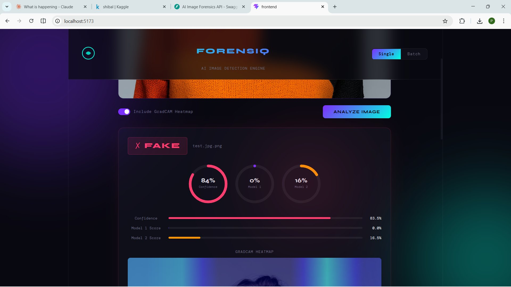
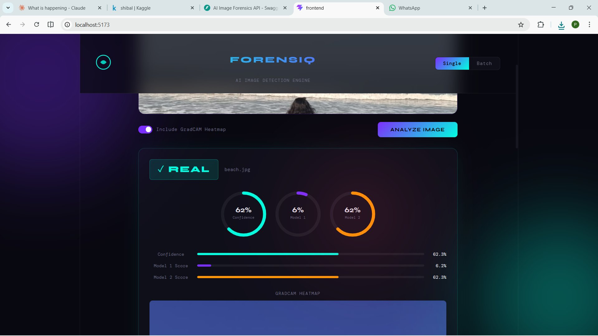
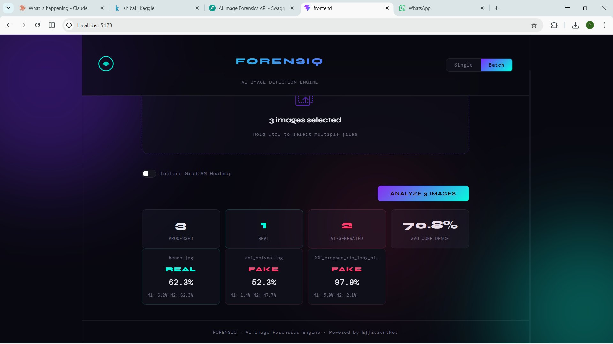
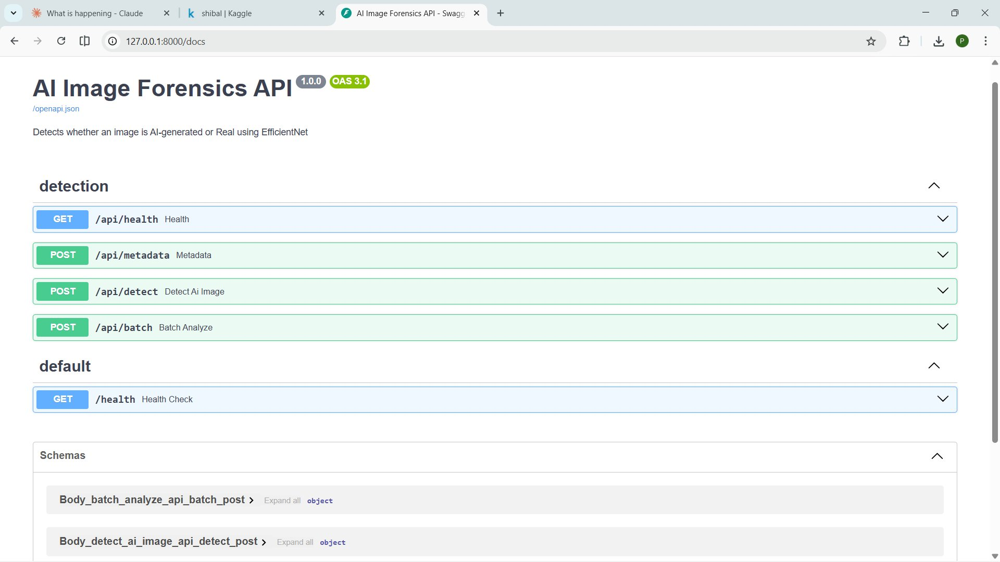

# FORENSIQ — AI Image Forensics Engine

> Detect whether an image is AI-generated or real using a dual EfficientNet model pipeline, served via a FastAPI backend and a React frontend.

   

---

## Screenshots

### Single Mode — FAKE Detection with GradCAM Heatmap


### Single Mode — REAL Detection with GradCAM Heatmap


### Batch Mode — Multiple Image Analysis


### REST API — Swagger Docs


---

## Overview

FORENSIQ is an end-to-end AI image forensics system that classifies images as **REAL** or **AI-Generated** using two independently trained EfficientNet models. Predictions from both models are ensembled to improve reliability. The system also supports GradCAM heatmap visualization to explain model decisions.

---

## Model Performance

| Model | Dataset | Accuracy | AUC |
|---|---|---|---|
| Model 1 — `final_real_vs_fake_detector` | 140k Real & Fake Faces + CIFAKE | **87%** | — |
| Model 2 — `final_model2_general` | ArtiFact + CIFAKE + AI vs Real Images | **86.9%** | **0.9545** |

**Model 1 Classification Report:**
- REAL → Precision: 0.81, Recall: 0.97, F1: 0.88
- FAKE → Precision: 0.96, Recall: 0.77, F1: 0.86

Trained on Kaggle using GPU accelerated notebooks.

---

## Features

- **Single Image Detection** — Upload any image and get a REAL/FAKE verdict with confidence scores
- **Batch Processing** — Analyze up to 20 images at once with summary statistics
- **Dual Model Ensemble** — Two independently trained EfficientNet models for robust predictions
- **GradCAM Heatmap** — Visual explanation of which regions influenced the model's decision
- **EXIF Metadata Analysis** — Extract and analyze image metadata for additional forensic signals
- **REST API** — FastAPI backend with Swagger docs at `/docs`

---

## Tech Stack

**Backend**
- Python 3.10+
- FastAPI + Uvicorn
- TensorFlow / Keras (EfficientNet)
- Pillow, NumPy

**Frontend**
- React 18 + Vite
- Vanilla CSS (no UI library)

**ML / Training**
- Kaggle (GPU T4)
- Datasets: 140k Real & Fake Faces, ArtiFact, CIFAKE, AI Generated Images vs Real Images

---

## Project Structure

```
AI-Image-Forensics/
├── backend/
│   ├── app/
│   │   ├── api/
│   │   │   └── routes.py          # API endpoints
│   │   ├── models/
│   │   │   ├── predictor.py       # Dual model inference
│   │   │   ├── gradcam.py         # GradCAM heatmap
│   │   │   └── metadata.py        # EXIF extraction
│   │   └── utils/
│   │       └── image_processing.py
│   ├── models/checkpoints/        # Trained .keras model files
│   ├── main.py
│   └── requirements.txt
├── frontend/
│   └── src/
│       ├── App.jsx
│       └── App.css
├── assets/                        # Screenshots for README
└── README.md
```

---

## Getting Started

### Prerequisites
- Python 3.10+
- Node.js 18+

### 1. Clone the repository
```bash
git clone https://github.com/Premaa13/AI-Image-Forensics.git
cd AI-Image-Forensics
```

### 2. Backend setup
```bash
cd backend
python -m venv venv
venv\Scripts\activate        # Windows
pip install -r requirements.txt
uvicorn app.main:app --reload
```
Backend runs at `http://127.0.0.1:8000`
API docs at `http://127.0.0.1:8000/docs`

### 3. Frontend setup
```bash
cd frontend
npm install
npm run dev
```
Frontend runs at `http://localhost:5173`

### 4. Add model weights
Place the trained `.keras` files in:
```
backend/models/checkpoints/
├── final_real_vs_fake_detector.keras
└── final_model2_general.keras
```

---

## API Endpoints

| Method | Endpoint | Description |
|---|---|---|
| POST | `/api/detect` | Single image detection |
| POST | `/api/batch` | Batch image detection |
| POST | `/api/metadata` | EXIF metadata extraction |
| GET | `/api/health` | Health check |

---

## Author

**Prema S**
Built as a first AI/ML project exploring image forensics and deep learning.

---

## License

MIT
